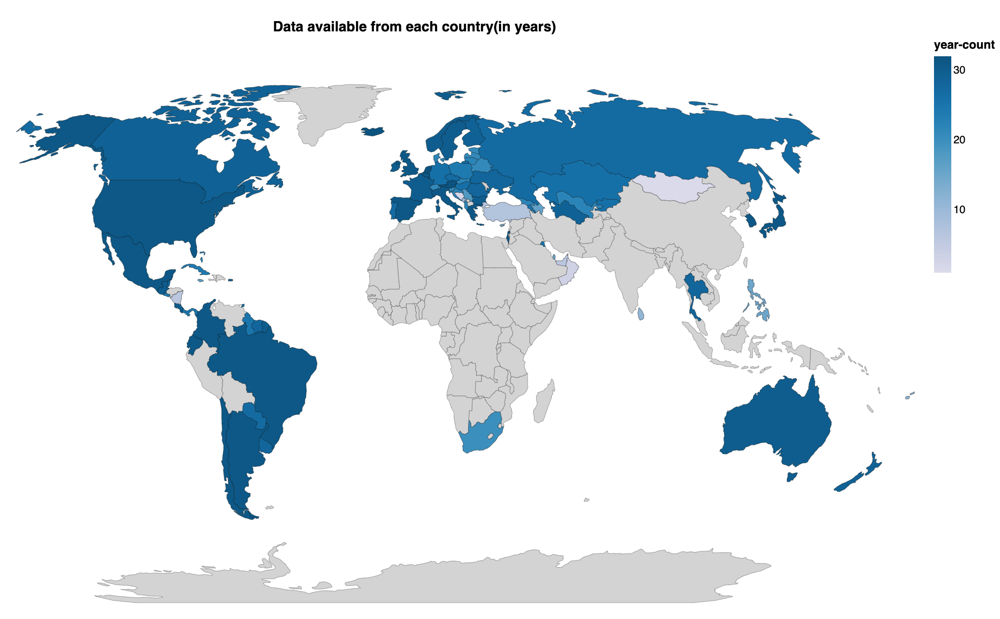
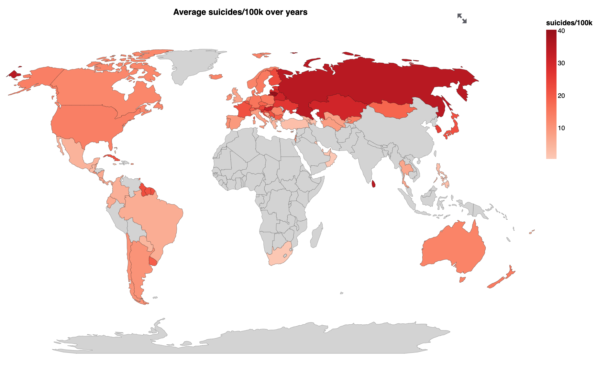
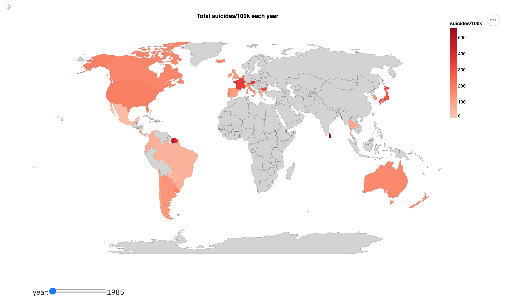
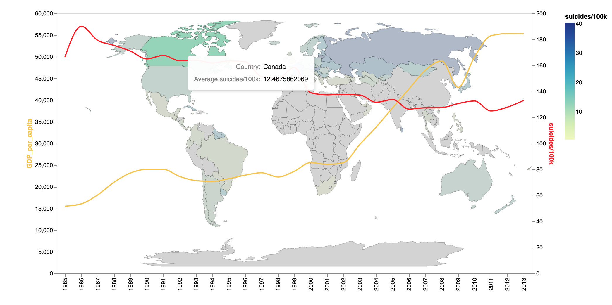
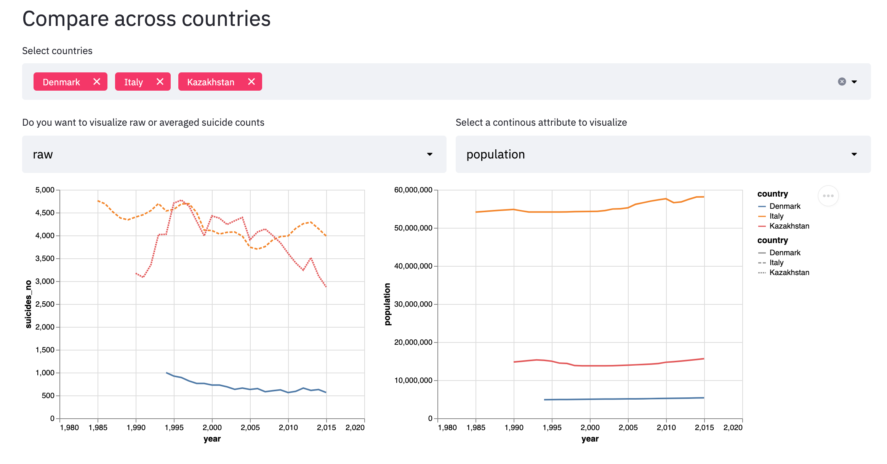
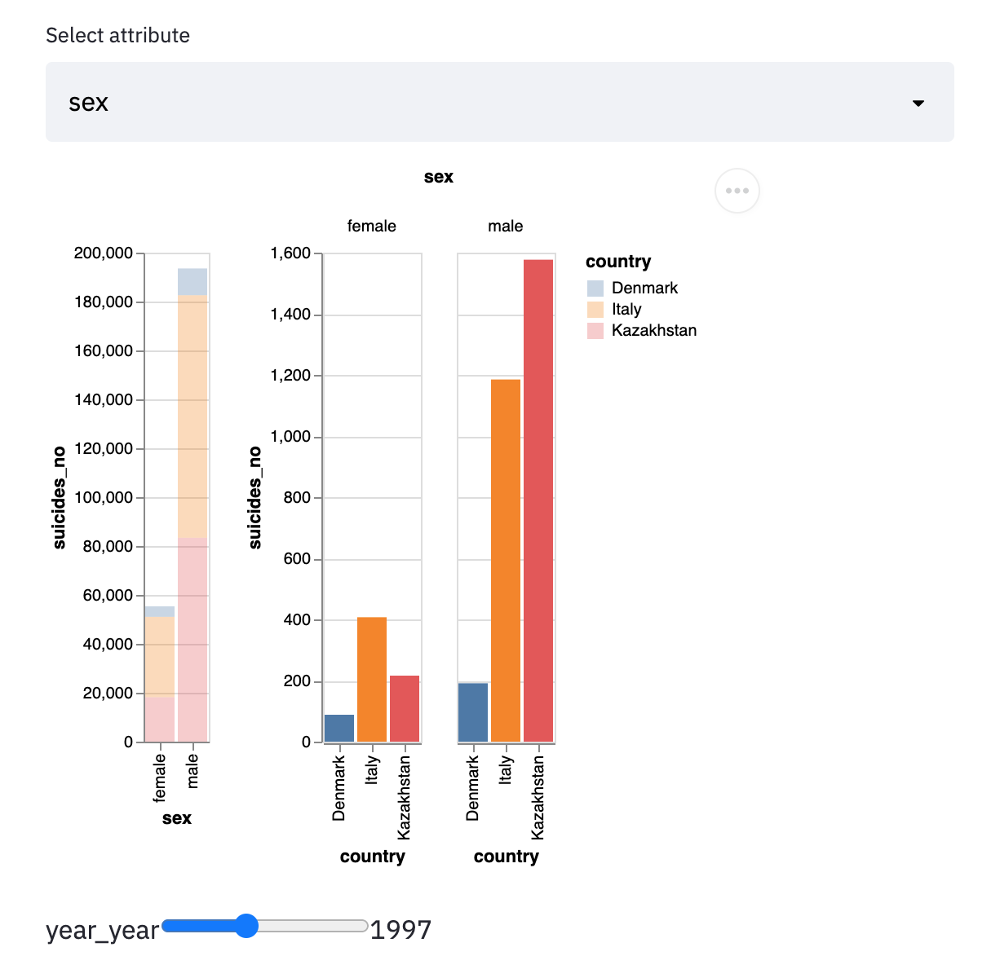
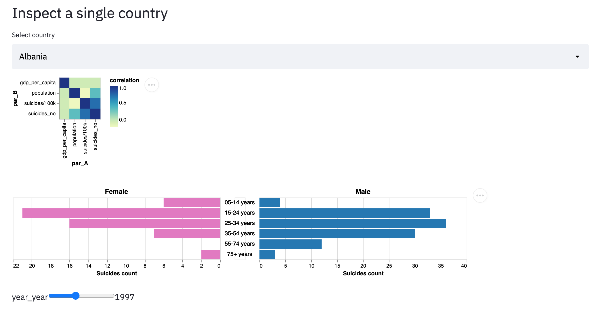

# Suicide rate around the world

Our app is designed to raise the awareness of suicide by presenting the suicide rate changes from different countries over last three decades. The app integrates multiple interactive plot to enable to users to explore the relationship between suicide rates and geographics, age groups, genders and gross domestic product per capita. 

## Project Goals

According to World Health Organization, around 800,000 people die from suicide globally each year. Suicide is one of the leading causes of death in US and the number has been increasing over years. Our project aims to present the trend of suicide rate changes over time and investigate the suicide rate difference among varied groups including gender, age, and GDP.

## Design

Page 1:
The first page of our app provides an overview of our dataset. The dataset includes suicide data from many countries in different continent. However, the distribution of data available in countries mainly is not well balanced. For example, only a few countries in Asia and Africa have records in the dataset, compared with almost all European countries being available. So the first map gives users a big picture of how many years of data are available from each country on the map, with the darker color representing more data points. The data point availability map is then followed by an average suicide rate map and for each country, the average of suicide number per 100k population is calculated, combining the suicide cases from all genders and age groups. This map gives uses a general idea how geographic location plays a role in the suicide rate difference. Then as a detailed expansion view of the yearly suicide cases per 100k population, the third graph is an interactive map that enables users to select a year and view the suicides per 100k in different countries. This map offers a global view of suicide number changes over time. The three maps together show a brief overview of our multi-dimensional dataset. 
The alternative of the overview part would be a bar plot with each bar representing a country. But due to the large number of countries we choose to visualize, we decided to choose the choropleth map, which also helps the users to conceptualize the data points in a more intuitive way. 

Page 2:
 
The app offers another interactive map on the second page, with which users can explore the relationship of changes in suicide numbers and GDP per capita. The users can select a country on the world map and a line graph with dual axis of the time series of suicide cases per 100k and GDP of the corresponding country will overlay on the map. The resulting plot offers multiplelayers of information at once: the location and size of the country, suicide rates and GDP overtime, which we found to be a neat way to convey information. Previously, we also considered to include HDI (Human Development Index) in this plot. However, there are many missing HDI data, that many countries do not have this value available. Also, if adding a third axis to the plot, together with the overlying world map, the figure would become visually heavy and overwhelming. Thus, we think the current design is better. 

Page 3:

The users may want to compare over a few countries or inspect a single country of interest in depth. The 3rd page of our app enables users to do so.
Section 1: Compare across countries
The first line plot in this section shows the raw/average suicide counts over time of all selected countries to let the user visualize the over trends. We also tried to use a bar plot before, but there were large overlapped areas without carrying important information, so we switched to a line plot.The second line plot is for the users to observe the trend of a specific quantitative attribute over time of those interested countries.  Also, it seems that line plots are a good fit for visualizing changes of numeric variables.

In the second row, there are two bar plots: a layered one and a grouped one. The layered one is intended to show the distribution of the selected feature in different countries, and the grouped one to show the differences across countries in terms of all groups of that feature in a specific year (selected by the slider below). We think bar plots in general are good at displaying discrete variables, and the two different types of bar plots convey overall/detailed information better respectively.

Section 2: Inspect a single country
The second section is dedicated to the inspection of a single country. The first heatmap shows the correlations between the two continuous variables (gdp per capita and population size) and two suicide counts (averaged over population and row counts).

The second “pyramid plot” (two bar plots) is intended to show the age distribution within two gender groups in a specific year of interest selected in the slider below. We also considered a grouped bar plot for this purpose, but it turns out the pyramid plot shows the age distribution within specific groups better and makes it straightforward to compare across the two genders.

Challenges:
We encountered several challenges when developing this app, due to lack of experience with altair. Choosing the visualization design, especially how to enable the interaction is another major challenge for us because of the number of dimensions of the dataset.

## Development

We first searched for interesting datasets on Kaggle and decided on the current one we are using right now together. Then we examined the dataset in more depth, and brainstormed about suitable visualizations for our data.
After discussing the overall plan for our app, we splitted the work: Wanqiao would work on the visualization of the worldwide overview, and Zhiyun on detailed inspection of a single country and comparisons among a few countries. Finally, we put our results together into a multi-page web application.

Roughly each of us spent 5-10 alone developing the app, and we spent about 10 hours discussing and reviewing progress. In total, each person roughly committed 15-20 hours to this assignment.

Coming up with a prototype was relatively fast, but the revision and debugging of our app in order to achieve satisfactory visualization took the most time.

## Success Story

The visualization of suicide rate changes conveys some alarming messages from multiple aspects. First, we noticed a significant difference in suicide cases between male and female with male having much higher suicide rates. Secondly, when looking at the GDP trends and suicide rates, we found that some countries have increasing GDP and suicide number. We also notice that some countries, for example, Korea and Russia, have significantly higher suicides than other areas. In conclusion, more efforts should be invested to study the causes of suicides and its social impacts.
